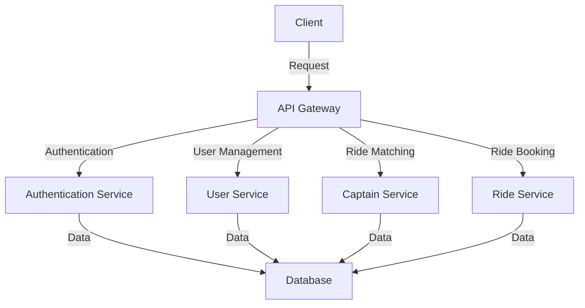

# DropRide Backend - Ride Sharing Platform

## 📝 Table of Contents
- [Project Overview](#-project-overview)
- [Tech Stack](#-tech-stack)
- [System Architecture](#-system-architecture)
- [Getting Started](#-getting-started)
- [Environment Setup](#-environment-configuration)
- [API Documentation](#-api-documentation)
- [Authentication Flow](#-authentication-mechanism)
- [Database Schema](#-database-schema)
- [Security Features](#-security-features)
- [Performance Optimization](#-performance-optimization)
- [Testing Strategy](#-testing-strategy)
- [Deployment](#-deployment-guide)
- [Monitoring and Logging](#-monitoring-and-logging)
- [Contributing Guidelines](#-contributing-guidelines)
- [License](#-license)

## 🚀 Project Overview

DropRide is a comprehensive ride-sharing platform designed to connect users with captains efficiently and securely. The backend serves as the core infrastructure, managing authentication, user interactions, and data processing.

## 🛠 Tech Stack

- **Language**: Node.js
- **Framework**: Express.js
- **Database**: MongoDB
- **ODM**: Mongoose
- **Authentication**: JSON Web Tokens (JWT)
- **Password Encryption**: bcrypt
- **Validation**: express-validator
- **Middleware**: 
  - cors
  - cookie-parser
- **Environment Management**: dotenv

## 🏗 System Architecture

### Architectural Pattern
- Microservices-ready modular architecture
- Separation of concerns
- Scalable and maintainable design

### API Workflow



### Components
- **API Gateway**: Centralized entry point for all client requests.
- **Authentication Service**: Handles user authentication and token management.
- **User Service**: Manages user profiles and settings.
- **Captain Service**: Manages captains' profiles, availability, and ride acceptance.
- **Ride Service**: Handles ride bookings, status updates, and fare calculations.
- **Database**: Stores all persistent data.

## 🚀 Getting Started

### Prerequisites
- Node.js (v16 or higher)
- MongoDB (v4.4 or higher)
- npm or yarn

### Installation

1. Clone the repository:
   ```bash
   git clone https://github.com/yourusername/dropride-backend.git
   cd dropride-backend
   ```
2. Install dependencies:
   ```bash
   npm install
   ```

3. Set up the environment variables:
   ```bash
   cp .env.example .env
   ```
4. Start the development server:
   ```bash
   npm run dev
   ```

## 🛠 Environment Configuration

### Required Variables
- `PORT`: Port number for the server.
- `DB_URI`: MongoDB connection string.
- `JWT_SECRET`: Secret key for JWT.
- `SALT_ROUNDS`: Number of salt rounds for bcrypt.

## 📈 API Documentation

### Endpoints

#### Authentication
| Method | Endpoint          | Description          |
|--------|-------------------|----------------------|
| POST   | /auth/register    | User registration    |
| POST   | /auth/login       | User login           |
| GET    | /auth/verify      | Token verification   |

#### User Management
| Method | Endpoint          | Description          |
|--------|-------------------|----------------------|
| GET    | /user/profile     | Get user profile     |
| PATCH  | /user/update      | Update user details  |

#### Ride Booking
| Method | Endpoint          | Description          |
|--------|-------------------|----------------------|
| POST   | /ride/request     | Request a ride       |
| GET    | /ride/status/{id} | Get ride status      |
| PATCH  | /ride/cancel/{id} | Cancel a ride        |

## 🔐 Authentication Mechanism

1. **User Registration**:
   - Endpoint: `/auth/register`
   - Validates user data.
   - Hashes password using bcrypt.
   - Stores user details in the database.

2. **User Login**:
   - Endpoint: `/auth/login`
   - Verifies user credentials.
   - Issues a JWT for authentication.

3. **Token Verification**:
   - Middleware ensures protected routes are accessible only with valid tokens.

## 📊 Database Schema

### User Schema
```javascript
{
  fullname: {
    firstname: String,
    lastname: String
  },
  email: String,
  password: String,
  createdAt: Date
}
```

### Ride Schema
```javascript
{
  userId: ObjectId,
  captainId: ObjectId,
  status: String,
  fare: Number,
  route: {
    start: String,
    destination: String
  },
  createdAt: Date
}
```

## 🛨️ Security Features

- Encrypted passwords with bcrypt.
- JWT-based secure authentication.
- Input validation using `express-validator`.
- CORS policy to restrict unauthorized access.

## 💪 Performance Optimization

- Indexing for database queries.
- Pagination for large dataset responses.
- Efficient caching with Redis (optional).

## 📈 Testing Strategy

- Unit tests for individual modules.
- Integration tests for APIs.
- End-to-end tests for workflows.

## 🚀 Deployment Guide

1. **Build the project**:
   ```bash
   npm run build
   ```

2. **Deploy using Docker**:
   - Build the Docker image:
     ```bash
     docker build -t dropride-backend .
     ```
   - Run the container:
     ```bash
     docker run -p 3000:3000 dropride-backend
     ```

3. **Deployment Platforms**:
   - AWS EC2
   - Heroku
   - Vercel (API-only)

## 🐛 Monitoring and Logging

- **Monitoring**:
  - Use tools like Prometheus and Grafana for monitoring.
- **Logging**:
  - Use Winston for structured logging.
  - Centralize logs with services like Loggly or ELK stack.

## 📚 Contributing Guidelines

1. Fork the repository.
2. Create a new feature branch:
   ```bash
   git checkout -b feature-name
   ```
3. Commit your changes and push:
   ```bash
   git commit -m "Add feature"
   git push origin feature-name
   ```
4. Create a Pull Request.

## 💎 License

This project is licensed under the MIT License. See the `LICENSE` file for more details.
